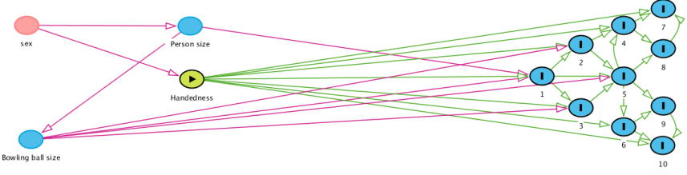

<style type="text/css">
slides > slide:not(.nobackground):after {
  content: '';
}
</style>

<script type="text/x-mathjax-config">
MathJax.Hub.Register.StartupHook("TeX Jax Ready",function () {
  MathJax.Hub.Insert(MathJax.InputJax.TeX.Definitions.macros,{
    cancel: ["Extension","cancel"],
    bcancel: ["Extension","cancel"],
    xcancel: ["Extension","cancel"],
    cancelto: ["Extension","cancel"]
  });
});
</script>

```{r setup, include=FALSE}
options(width = 90, scipen = 1)
library(knitr)
library(dplyr)
library(ggplot2)
opts_chunk$set(echo = TRUE)
knit_hooks$set(small.mar = function(before, options, envir) {
    if (before) par(mar = c(4, 4, .1, .1), las = 1)  # smaller margin on top and right
})
set.seed(20220228)
options(mc.cores = parallel::detectCores())
```

\newcommand{\ind}{\perp\!\!\!\!\perp} 


## Graphical Causal Models Framework

- Potential Outcomes framework is widespread in economics & political science
  and is fine for obtaining point estimates of Average Causal Effects (ACEs) in
  simple experiments. It only involves probability theory and algebra / calculus.
- Graphical Causal Models framework is widespread in epidemiology and to a lesser extent,
  in sociology and psychology but is overkill for estimating ACEs in simple experiments
- A theorem in one framework implies a theorem in the other framework
- Directed Acyclic Graphs can serve multiple purposes:

  1. A language to communicate theories
  2. Identification Analysis: Whether a theory implies the ACE could be calculated in a 
    population
  3. Testable Implications: What observable variables are conditionally independent,
    which can be investigated with data

## Directed Acyclic Graphs (DAGs)

- Three elements to a DAG:

  1. Variables / Nodes
  2. Arrows from an earlier (in time) node to a later node
  3. Absence of arrows between nodes, which implies an ACE is zero
  
- $A \rightarrow B$ means that if $A$ were experimentally manipulated there MAY be a
  non-zero ACE that is assumed to be unmediated by any other variable
- Cannot start at any node, follow arrows, and get back to where you started
- DAGs are usually written w/o distributional or functional form assumptions

## Fork {.columns-2}

- $X\leftarrow\boxed{{Z}}\rightarrow Y$
- Like GDP* driving both GDI and GDP
- Stratifying on $Z$ implies $X \perp Y \mid Z$
- Not stratifying on $Z$ implies $X$ and $Y$ are marginally dependent, i.e
  $f\left(\bcancel{z} \bigcap x \bigcap y\right) \neq f\left(x\right) 
  \times f\left(y\right)$
```{r, fig.width=5, fig.height=5, message=FALSE}
tibble(z = rbinom(10^4, size = 1, 
                  prob = 0.5),
       x = rnorm( 10^4, mean =  z),
       y = rnorm( 10^4, mean = -z)) %>%
  ggplot(aes(x, y)) + geom_point() + 
  facet_wrap(~as.factor(z), ncol = 1) +
  geom_smooth(method = "lm", color = "red")
```

## Pipe (or chain) {.columns-2}

- $Z\overset{\beta_{1}}{\rightarrow} X \overset{\beta_{2}}{\rightarrow}Y$
- Stratifying on $X$ implies $Z \perp Y \mid X$
- Not stratifying on $X$ implies $Z$ and $Y$ are marginally dependent, i.e
  $f\left(z \bigcap \bcancel{x} \bigcap y\right) \neq f\left(z\right) \times 
  f\left(y\right)$
- Iff the relationships are linear the marginal effect of $Z$
  on $Y$ is $\beta_1 \beta_2$
```{r, fig.width=5, fig.height=5, message = FALSE}
tibble(z = rnorm( 10^4),
       x = rbinom(10^4, size = 1, 
                  prob = pnorm(z)),
       y = rnorm( 10^4, mean = x)) %>%
  ggplot(aes(z, y)) + geom_point() + 
  facet_wrap(~as.factor(x), ncol = 1) +
  geom_smooth(method = "lm", color = "red")
```

## Collider {.columns-2}

- $X\rightarrow Z \leftarrow Y$
- Not stratifying on $Z$ implies $X$ and $Y$ are marginally independent, i.e
  $f\left(x \bigcap \bcancel{z} \bigcap y\right) = f\left(x\right) \times 
  f\left(y\right)$
- Stratifying on $Z$ implies $X$ and $Y$ are conditionally dependent, i.e
  $f\left(x \bigcap y \mid z\right) \neq f\left(x \mid z\right) \times 
  f\left(y \mid z \right)$
```{r, fig.width=5, fig.height=5, message = FALSE}
tibble(x = rnorm( 10^4),
       y = rnorm( 10^4),
       z = rbinom(10^4, size = 1,
                  prob = pnorm(x - y))) %>%
  ggplot(aes(x, y)) + geom_point() + 
  facet_wrap(~as.factor(z), ncol = 1) +
  geom_smooth(method = "lm", color = "red")
```

## Descendant {.columns-2}

- $Z\overset{\beta_{1}}{\rightarrow} X \overset{\beta_{2}}{\rightarrow}Y \rightarrow R$
- Not stratifying on $R$ implies effect of $Z$ on $Y$ is $\beta_1 \beta_2$ (assuming
  linearity)
- Stratifying on $R$ prevents you from recovering $\beta_1 \beta_2$ via regression
```{r, fig.width=5, fig.height=5, message = FALSE}
tibble(z = rnorm( 10^4),
       x = rnorm( 10^4, mean = z),
       y = rnorm( 10^4, mean = x),
       r = rbinom(10^4, size = 1,
                  prob = pnorm(y / 2))) %>%
  ggplot(aes(z, y)) + geom_point() + 
  facet_wrap(~as.factor(r), ncol = 1) + 
  geom_smooth(method = "lm", color = "red")
```


## Blocking / Closing a Path and d-separation

- A path is a sequence of connected nodes, regardless of the arrows' direction

  1. Causal Path: A path that exclusively follows the arrows
  2. Non-causal Path: Any other path

- To block a path, either

  1. Condition on a noncollider along a path: $A \leftarrow \fbox{C} \rightarrow B$
  2. Refrain from conditioning on a (descendant of a) collider along a path: $A \rightarrow C \leftarrow B$

> - Two variables are "d-separated" iff all paths between them are blocked by conditioning on a
  possibly empty set of variables $\{Z\}$, in which case they are conditionally independent
> - Two variables that are not "d-separated" are not conditionally independent

## Adjustment and Backdoor Criteria

- Adjustment Criterion is satisfied iff

  1. All non-causal paths from $X$ to $Y$ blocked by a (possibly empty) set of variables $\{Z\}$
  2. No variable in $\{Z\}$ lies on or descends from any causal path from $X$ to $Y$

- If the adjustment criterion is satisfied, ACE of $X$ on $Y$ is identified and can be
  consistently estimated with a (possibly weighted) difference in means
  
- Backdoor Criterion is satisfied iff

  1. No element of $\{Z\}$ is a descendant of $Y$
  2. Some element of $\{Z\}$ blocks all "backdoor" paths, i.e. those starting with $\rightarrow X$
  
- Backdoor Criterion implies Adjustment Criterion but not vice versa

## Bowling DAG

- What would you condition on if handedness is the treatment variable and 
  whether each pins gets knocked down is an outcome variable?




## Dagitty

- There is a [website](www.dagitty.net), that implements the most common and useful identification
  strategies for DAGs and a similar R package, dagitty:
```{r, small.mar = FALSE, fig.height=3, fig.width=10, message = FALSE}
library(dagitty); g <- dagitty( "dag{ x -> y ; x <-> m <-> y }" )
library(ggdag); ggdag(g) + theme_void()
```

## Double-headed Arrows

- The dagitty R package and a lot of authors use $A \leftrightarrow B$ as a shorthand
  for a $A \leftarrow U \rightarrow B$ with $U$ unobserved or for
  $\begin{matrix}X & \leftrightarrow & Y \\
                 \downarrow & \swarrow &\\
                 \fbox{C}   &             & \end{matrix}$ due to conditioning
- Any path involving a $\leftrightarrow$ is a non-causal path

## Contrasts with Common Practice

- Supervised learning generally does not utilize DAGs and is not capable of estimating causal
  effects. Models are scored on how well they predict the outcome (in the testing set), which
  is better if you condition on descendants of the outcome, mediators, some colliders, etc.
- Regressions generally do not estimate the causal effect of all covariates and rarely
  estimate the causal effect of any covariate. They implicitly correspond to a DAG like
  (although the error term is often omitted):
$$\begin{matrix} & \nearrow \fbox{X}_1 & \searrow &  \\
              C  & \rightarrow \fbox{X}_2 & \rightarrow & Y\leftarrow \epsilon\\
                 & \searrow \fbox{X}_3 & \nearrow & \end{matrix}$$
- Non-Bayesians tend to write DAGs without distributions, parameters, & priors

## CausalQueries R Package

- All DAGs where all observed nodes are binary have a (multinomial) likelihood function
  that can be combined with priors on the "type" parameters to perform Bayesian inference
- The CausalQueries R Package takes a DAG, priors, and data and uses Stan to draw from the
  posterior distribution of the parameters given the data & priors
- Useful for describing your beliefs about (not necessarily average) causal effects in
  many situations that are not simple experiments
  
## Dataset from Bertrand and Mullainathan (2004)

- Resumes were created for a fictitious person applying for an entry-level job but
  the name at the top of the resume was randomized to make the company think the applicant 
  was probably black / white / male / female. The outcome is whether the company called the
  applicant to schedule an interview, etc.
```{r, message = FALSE}
data(resume, package = "qss") # remotes::install_github("kosukeimai/qss-package")
resume <- mutate(resume, white = race == "white", female = sex == "female")
resume_grouped <- group_by(resume, white, female, call) %>% 
  summarize(n = n())
glimpse(resume_grouped)
```

## Basic Frequentist Inference

```{r}
prop.test(matrix(rev(resume_grouped$n), ncol = 2, byrow = TRUE,
                 dimnames = list(c("white_female", "white_male",
                                   "black_female", "black_male"),
                                 c("call", "no call"))))
```

> - Could get point estimates, but many questions prohibited by Frequentism, 
  e.g. "How sure are you that companies favor white / male over black / female?"

## Principal (not principled) Stratification {.build}

- If $X$ and $Y\left(X\right)$ are both binary, then there are $2^2 = 4$ types of observations:

Function                        | Rubin         | Synonym         | This Example
------------------------------- | ------------- | --------------- | -------------------
$Y\left(x\right) \neq x$        | Defiers       | **A**dverse     | Interview iff white
$Y\left(x\right) = x$           | Compliers     | **B**eneficial  | Interview iff black
$Y\left(x\right) = 0 \forall x$ | Never takers  | **C**hronic     | No interview regardless
$Y\left(x\right) = 1 \forall x$ | Always takers | **D**estined    | Interview regardless

$\downarrow$ What We Observe $\rightarrow$ | No interview   | Interview
------------------------------------------ | -------------- | ---------
White          | $\implies$ **B** or **C** | $\implies$ **A** or **D**
Black          | $\implies$ **A** or **C** | $\implies$ **B** or **D**

## Conditioning on the Resume Data


```{r, message = FALSE}
library(CausalQueries)
model <- make_model("white -> call <- female")
model %>% get_parameter_matrix %>% nrow # default priors are flat Dirichlet
```

```{r, resume, cache = TRUE, results="hide", message = FALSE}
model <- update_model(model, seed = 12345, data = resume)
```
```{r, query1, cache = TRUE}
query_model(model, using = "posteriors", queries = # can also ask about priors
              c(race_ACE = "call[white  = 0] - call[white  = 1]", 
                sex_ACE  = "call[female = 0] - call[female = 1]",
                Pr = "call[white = 0, female = 1] > call[white = 1, female = 1]"))
```

## Counterfactual Distributional Queries

```{r, query2, cache = TRUE, fig.height=4, fig.width=10, message = FALSE}
query_distribution(model, using = "posteriors", given = "white == 0", # condition
                   query = "call[white = 1]") %>% as.data.frame %>%   # counterfactual
  ggplot() + geom_density(aes(`.`)) + xlab("Probability of interview")
```

## A Model with Confounding {.build}

```{r, fig.width=8, fig.height=2.5, small.mar = FALSE}
model <- make_model("W <- X -> Y") %>% set_confound(list("W <-> X", "W <-> Y"))
CausalQueries:::translate_dagitty(model) %>% ggdag + theme_void()
```
```{r}
adjustmentSets(CausalQueries:::translate_dagitty(model), exposure = "X", outcome = "Y")
```

## Conditional vs. Joint Modeling

- If you do not condition on $W$ in the previous model, the ACE of $X$ on $Y$
  is identified and easy to estimate via regression, differences in means, etc.
- If you do condition on $W$, the ACE of $X$ on $Y$ is not identified and
  cannot be estimated correctly via regression, differences in means, etc.
- If you use CausalQueries, the model is of $W$, $X$, and $Y$ jointly, which
  does not condition on the collider, $W$
- You can subsequently do things like
```{r, eval = FALSE}
query_distribution(model, using = "posteriors", given = "W == 0", # condition
                   query = "Y[X = 1] - Y[X = 0]") # conditional ACE
```
