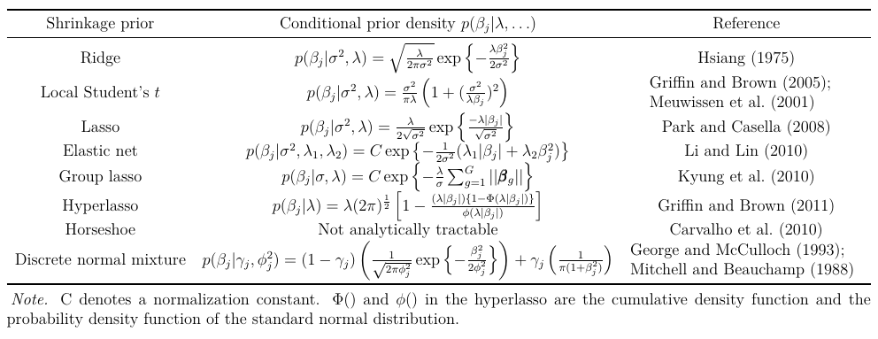

<style type="text/css">
slides > slide:not(.nobackground):after {
  content: '';
}
</style>

```{r setup, include=FALSE}
library(knitr)
set.seed(54321)
library(rstanarm); options(mc.cores = parallel::detectCores())
knit_hooks$set(small.mar = function(before, options, envir) {
    if (before) par(mar = c(4, 4, .1, .1), las = 1)  # smaller margin on top and right
})
library(dplyr)
```

## What Is Supervised Learning?

- Frequentism -- Probability = Basic Supervised Learning
- More influenced by tech companies. Within academics, more influenced
  by computer science, engineering, and operations research than statistics.
- Supervised learning does not require or use probability for estimation, 
  so no standard errors, $p$-values, confidence intervals, or hypothesis tests
  and no need for datasets to be random samples from any well-defined population
- Supervised learning retains the Frequentist approach for point estimating $\boldsymbol{\theta}$
  by solving an optimization problem and ignores all uncertainty about $\boldsymbol{\theta}$
- But if you are not going to do a hypothesis test, there is no need to maximize a
  (log)-likelihood function. Supervised learning instead maximizes a _penalized_
  (log)-likelihood function over $\boldsymbol{\theta}$, given a value of the
  tuning parameter(s), $\lambda$.

## Example of Supervised Learning: Rain Prediction

- Scientists predict weather using physics and chemistry with barometric pressure, temperature, 
  humidity and other data
- Google can [predict](https://ai.googleblog.com/2020/01/using-machine-learning-to-nowcast.html?m=1) weather better than scientists up to 6 hours into the future by dividing
  the USA up into one square kilometer blocks & using a neural net
  to learn that when it rains in one block it tends to rain in adjacent blocks
- [Advantages](https://arstechnica.com/science/2020/01/google-used-deep-learning-to-improve-short-term-weather-forecasts/) of Google's approach:

    - "Google says its system can produce results in less than 10 minutes", as opposed to 1 -- 3 hours while
    "computational demands limit the spatial resolution to about 5 kilometers" for science-based models
    - "you'd be able to look up a minute-by-minute rainfall forecast for your specific [bike] route. 
    Today's conventional weather forecast, by contrast, might just tell you that there's a 30-percent 
    chance of precipitation in your town over the next couple of hours."

> - But is Google's approach scientific or useful for (social) science?

## Penalization vs. Priors

- These penalty functions are often some [prior](https://osf.io/4ev8h/) log-kernel conditional on
  a tuning parameter, $\lambda$, and possibly auxiliary parameters like $\sigma$


- Penalty functions used in supervised learning make for 
[poor priors](https://statmodeling.stat.columbia.edu/2017/11/02/king-must-die/) because they are 
  intended to shift the mode rather than reflect beliefs

## Comparison to Lasso

* Lasso chooses coefficients to minimize the penalized objective function
$$\sum_{n=1}^N\left(y_n - \alpha - \sum_{k=1}^K \beta_k x_{nk} \right)^2 + 
  \lambda \sum_{k=1}^K\left|\beta_k\right|$$
* That is proportional to the negative posterior kernel with $\sigma = 1$, a Gaussian likelihood,
  and independent Laplace priors on the coefficients with location zero and FIXED inverse 
  scale $\lambda$
* The Laplace distribution is the maximum entropy distribution for a real random variable under 
  the constraint $\mathbb{E}\left|\beta\right| = \frac{1}{\lambda}$
* Posterior MODE corresponds to the Lasso solution for a given $\lambda$
* Only recently did some of the Tibshiranis (and co-authors) 
  [derive](http://statweb.stanford.edu/~tibs/ftp/covtest-talk.pdf) a sampling distribution for the
  Lasso point estimator (for a given sparsity) across datasets

## Logit Model, No Intercept, Single Coefficient

```{r, echo = FALSE, fig.height = 5, fig.width=10, small.mar = TRUE}
log_prior <- function(beta_proposal, location = 0, scale = 1 / sqrt(2)) {
  return(-log(2 * scale) - abs( (beta_proposal - location) / scale ))
}
log_sum_exp <- function(a,b) {
  m <- pmax(a,b)
  return( ifelse(a > b, m + log1p(exp(b - m)), 
                        m + log1p(exp(a - m))) )
}
ll <- function(beta_proposal, x, y) {
  stopifnot(is.numeric(beta_proposal), is.numeric(x), is.numeric(y))
  neg_x_beta_proposal <- -outer(x, beta_proposal)
  denominator <- log_sum_exp(0, neg_x_beta_proposal)
  return(colSums(neg_x_beta_proposal[y == 0, , drop = FALSE]) - 
         colSums(denominator))
}
set.seed(12345)
N <- 9
y <- c(rep(1:0, times = 4), 1)
x <- rnorm(N)
LIM <- c(-4, 10)
curve(exp(log_prior(beta)), from = LIM[1], to = LIM[2], xname = "beta", ylab = "On log-scale",
      xlab = expression(beta), log = "y", ylim = c(1e-8, 0.6), n = 1001)
curve(exp(ll(beta, x, y)), from = LIM[1], to = LIM[2], xname = "beta", 
      add = TRUE, col = "red", lty = "dashed", log = "y", n = 1001)
kernel <- function(beta, x, y) {
  exp(ll(beta, x, y) + log_prior(beta))
}
denom <- integrate(kernel, x = x, y = y, lower = -Inf, upper = Inf)$value
curve(kernel(beta, x, y) / denom, from = LIM[1], to = LIM[2], xname = "beta", 
      add = TRUE, col = "blue", lty = "dotted", log = "y", n = 1001)
legend("topright", legend = c("Laplace prior", "likelihood", "posterior"), 
       col = c(1,2,4), lty = 1:3, box.lwd = NA)
```

## Training and Testing Data
  
- How do supervised learners choose $\lambda$?
- Split the dataset randomly into about 80% training and 20% testing (but ignore
  how this randomization affects all your conclusions)
- Solve a penalized optimization problem using the training data and a guess of $\lambda$ 
  to get a $\widehat{\boldsymbol{\theta}}$, often with $K$-fold or bootstrapping within training
- Do not look at $\widehat{\boldsymbol{\theta}}$, but predict the outcome in the testing data with it
- Average the prediction metric over the observations in the testing set
- Repeat on the same training and testing datasets but with other models

> - Primary focus is on the decision of which model (among many) to use
> - But there is no probability in $\widehat{\boldsymbol{\theta}}$ so there are no EXPECTATIONS
> - Choose the model that actually works best in that testing set in hopes that it will work
  best in future datasets

## What Is [Bayesian Machine Learning](http://www.columbia.edu/~jwp2128/Teaching/BML_lecture_notes.pdf)?

- No consensus definition, but there are several non-exclusive possibilities:

1. Specifies $f\left(\boldsymbol{\theta} \mid \mathbf{y}\right)$ but 
  [does not care](https://www.microsoft.com/en-us/research/uploads/prod/2006/01/Bishop-Pattern-Recognition-and-Machine-Learning-2006.pdf)
  about it except insofar as it affects the posterior predictive density
  of a future $\widetilde{y}$, whose PDF is
  $$f\left(\widetilde{y} \mid \mathbf{y}\right) = \int_{-\infty}^\infty \cdots \int_{-\infty}^\infty 
    \int_{-\infty}^\infty f\left(\widetilde{y} \mid \boldsymbol{\theta}\right)
    f\left(\boldsymbol{\theta} \mid \mathbf{y}\right) d\theta_1 d\theta_2 \dots d\theta_K$$
2. Specifies $f\left(\boldsymbol{\theta} \mid \mathbf{y}\right)$ but only finds the mode,
  rather than doing MCMC
3. Finds a tractable (multivariate normal) distribution that is closest to
  $f\left(\boldsymbol{\theta} \mid \mathbf{y}\right)$
4. If $y = \mu\left(\boldsymbol{\theta}, \mathbf{x}\right) + \epsilon$,
  put a prior on the unknown but continuous function $\mu\left(\boldsymbol{\theta}, \mathbf{x}\right)$,
  rather than assuming it is linear, polynomial, etc.
5. Bayesian but intended to scale well with data rather than model complexity

## Overfitting

- Maximum likelihood maximizes overfitting: A MLE is the value of $\boldsymbol{\theta}$
  such that the most likely dataset of size $N$ to be drawn from the population is the dataset at
  hand. Every other potential dataset will exhibit worse fit.
- A fundamental principle of supervised learning is that you evaluate models on testing
  data that were not used when solving the optimization problem for $\widehat{\boldsymbol{\theta}}$

> - Overfitting is primarily due to the choice to use optimization to find a single 
  $\widehat{\boldsymbol{\theta}}$
> - If you choose to use Bayesian methods and average the fit measure over your uncertainty in 
  the posterior distribution, you shouldn't overfit the observed $\mathbf{y}$
> - If overfitting is still a problem when doing MCMC, it is often due to improper or
  excessively weak priors (or likelihoods) that no one believes anyway
> - If Bayesians are going to split into training and testing data, there should be
  $N - 1$ observations in the training data and $1$ in the testing data

## Diamonds Data

```{r}
data("diamonds", package = "ggplot2")
diamonds <- diamonds[diamonds$z > 0, ]
glimpse(diamonds)
```

## Overfitting Diamonds?

```{r, diamonds, cache = TRUE, results = "hide", warning = FALSE}
post <- # note interaction terms
  stan_lm(log(price) ~ carat * (log(x) + log(y) + log(z)) + 
          cut + color + clarity, data = diamonds, 
          adapt_delta = 0.9, seed = 12345,
          prior = R2(location = 0.8, what = "mode"))
```
```{r, overfitting_diamonds, cache = TRUE, dependson="diamonds"}
PPD <- posterior_predict(post, draws = 1000); dim(PPD)
lower <- apply(PPD, MARGIN = 2, quantile, probs = 0.25)
upper <- apply(PPD, MARGIN = 2, quantile, probs = 0.75)
with(diamonds, c(too_low = mean(log(price) < lower), too_high = mean(log(price) > upper),
     just_right = mean((log(price) > lower) & (log(price) < upper)))) # not too bad
```

## Utility Function for Predictions of Future Data

- For Bayesians, the log predictive PDF is the most appropriate utility function
- Choose the model that maximizes the expectation of this over FUTURE data
$$\mbox{ELPD} = \mathbb{E}_Y \ln f\left(y_{N + 1}, y_{N + 2}, \dots, y_{2N} \mid y_1, y_2, \dots, y_N\right) = \\
  \ln \int_{-\infty}^\infty \cdots \int_{-\infty}^\infty \int_{-\infty}^\infty 
  f\left(y_{N + 1}, y_{N + 2}, \dots, y_{2N} \mid \mathbf{y}\right) 
  dy_{N + 1} dy_{N + 2} \dots dy_{2N} \approx  \\
  \sum_{n = 1}^N \ln f\left(y_n \mid \mathbf{y}_{-n}\right) = \sum_{n = 1}^N
  \ln \int_\Theta f\left(y_n \mid \boldsymbol{\theta}\right) 
  f\left(\boldsymbol{\theta} \mid \mathbf{y}_{-n}\right) d\theta_1 d\theta_2 \dots d\theta_K$$
  
> - $f\left(y_n \mid \boldsymbol{\theta}\right)$ is just the $n$-th likelihood contribution,
  but can we somehow obtain $f\left(\boldsymbol{\theta} \mid \mathbf{y}_{-n}\right)$ from 
  $f\left(\boldsymbol{\theta} \mid \mathbf{y}\right)$?
> - Yes, assuming $y_n$ does not have an outsized influence on the posterior  

## Literal Leave-One-Out Cross-Validation

```{r, post_1, cache = TRUE, results = "hide", warning = FALSE}
post_1 <- update(post, data = diamonds[-1, ]) # tedious for many observations
```
```{r, fig.height=4, fig.width=10, message = FALSE}
bayesplot::ppc_intervals(y = diamonds$price[1], # in dollars rather than log-dollars
                         yrep = exp(posterior_predict(post_1, newdata = diamonds[1, ])))
```

## PSISLOOCV with Logit Models

```{r, nes, cache = TRUE, message = FALSE}
load("nes.rda") # creates data.frame called nes
nes$income <- as.factor(nes$income) # do not treat income categories as continuous
nes$age <- nes$age / 10 # put respondent age into decades rather than years
nes2000 <- nes[!is.na(nes$rvote) & nes$year == 2000, ] # George W. Bush vs. Al Gore
```
```{r, logit, cache = TRUE, results="hide", dependson = nes}
post_flat <- stan_glm(rvote ~ age + I(age ^ 2) + income + white, data = nes2000, 
                      family = binomial(link = "logit"), QR = TRUE)
```
```{r}
(loo_post_flat <- loo(post_flat)) # p_loo is an estimate of the effective parameters
```

## Smooth Models

- What if instead of saying that the log-odds of voting Republican are quadratic
  in the person's `age`, we allow the log-odds to be any smooth function of `age`?
- This smooth function is estimated as the summation of many basis functions
  that have coefficients with normal priors whose standard deviation is _unknown_
  and estimated along with everything else by Stan
```{r, smooth, cache = TRUE, results = "hide", dependson = nes}
post_smooth <- stan_gamm4(rvote ~ s(age) + income + white, data = nes2000, seed = 33,
                          family = binomial(), QR = TRUE, adapt_delta = 0.99)
```
```{r}
(loo_post_smooth <- loo(post_smooth)) # p_loo is actually smaller now
```

## Comparison

```{r}
loo_compare(loo_post_flat, loo_post_smooth)
loo_model_weights(stanreg_list(post_flat, post_smooth))
```

- The second model is expected to predict future data better than the first

## PSISLOO$R^2$ for Previous Examples {.build}

```{r, looR2, cache = TRUE, dependson="diamonds", warning = FALSE}
summary(loo_R2(post)) # uses leave-one-out concepts
summary(as.data.frame(post)$R2) # does not use leave-one-out concepts
```
```{r, bayesR2, cache = TRUE}
# works with stan_glm and stan_gamm4 too
rbind(loo_R2    = summary(loo_R2(post_smooth)),
      bayes_R2  = summary(bayes_R2(post_smooth)))
```

## This Is Not Good (& likely caused slight overfitting)

```{r, bad, cache = TRUE, fig.height = 5, fig.width = 10}
plot(loo(post), label_points = TRUE) # from diamonds example
```

## What were those data points?

```{r}
glimpse(diamonds[c(20686, 21646, 24059, 27402, 48394, 49173), ]) # these are messed up data
```

## Refitting the Diamonds Model 6 Times

```{r, reloo, cache = TRUE, fig.height = 5, fig.width = 10, message=FALSE}
plot(loo(post, k_threshold = 0.7), label_points = TRUE)
```

## Posterior Predictive Checking

```{r, message = FALSE, fig.height = 5, fig.width=10}
pp_check(post_smooth, plotfun = "bars_grouped", group = nes2000$income)
```

## More Posterior Predictive Checking

```{r, message = FALSE, fig.height = 5, fig.width=10}
pp_check(post_smooth, plotfun = "error_binned")
```

## Classification

- When the outcome is binary, supervised learners will often obtain classifications
  of the outcome in the testing data
```{r}
MLE <- glm(rvote ~ age + I(age ^ 2) + income + white, data = nes2000, family = binomial)
nes1996 <- nes[!is.na(nes$rvote) & nes$year == 1996, ] # Bill Clinton vs. Bob Dole
classifications <- predict(MLE, newdata = nes1996, type = "response") > 0.5
round(prop.table(table(truth = nes1996$rvote, classifications)), digits = 2)
```

- This is known as a confusion matrix and you can calculate many functions of it

## Scoring Rules

- The proportion of correct classifications is a classic example of an "improper"
  scoring rule due to the discontinuity at $0.5$
- Bayesians (should, and typically do) use "strictly proper" scoring rules
  https://en.wikipedia.org/wiki/Scoring_rule , such as the ELPD, 
  which are defined by the property that they are maximized / minimized by the truth
- If the model is correct, the posterior predictive distribution is expected
  to yield the best-calibrated predictions with respect to any strictly proper
  scoring rule
- Supervised learning presumes there is no truth, in which case, the justification
  for using a strictly proper scoring rule is less compelling. However, the choice
  of which improper scoring rule to use can determine which modeling procedure is
  best in the testing data

## Data Science Venn Diagram {.build}

<div class="columns-2">


> - What do you get if you equate $\dots$
> - <div class="green2"> Probability </div>
> - <div class="blue2"> Priors, DAGs, and Model Building</div>
> - <div class="red2"> Markov Chain Monte Carlo </div>
> - Since at least $1990$, Bayesian estimation has
  been what data science purported to be but isn't
> - Data science came along later but largely ignored Bayesian approaches
> - In reality, data science programs are asymmetric with more
  emphasis on hacking skills and less on the others
</div>
