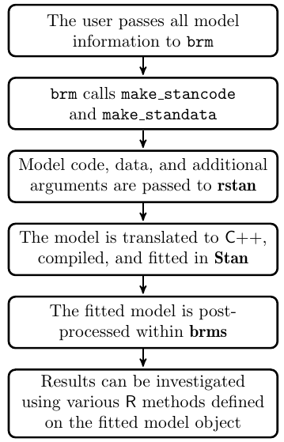

<style type="text/css">
slides > slide:not(.nobackground):after {
  content: '';
}
</style>

```{r setup, include=FALSE}
options(width = 90)
options(mc.cores = parallel::detectCores())
library(knitr)
library(knitr)
hook_output <- knit_hooks$get("output")
knit_hooks$set(output = function(x, options) {
  lines <- options$output.lines
  if (is.null(lines)) {
    return(hook_output(x, options))  # pass to default hook
  }
  x <- unlist(strsplit(x, "\n"))
  more <- "..."
  if (length(lines)==1) {        # first n lines
    if (length(x) > lines) {
      # truncate the output, but add ....
      x <- c(head(x, lines), more)
    }
  } else {
    x <- c(more, x[lines], more)
  }
  # paste these lines together
  x <- paste(c(x, ""), collapse = "\n")
  hook_output(x, options)
})
knit_hooks$set(small.mar = function(before, options, envir) {
    if (before) par(mar = c(4, 4, .1, .1), las = 1)  # smaller margin on top and right
})
```

## Scoring Rules

- The proportion of correct classifications is a classic example of an "improper"
  scoring rule due to the discontinuity at $0.5$
- Bayesians (should, and typically do) use "strictly proper" scoring rules
  https://en.wikipedia.org/wiki/Scoring_rule , such as the ELPD, 
  which are defined by the property that they are maximized / minimized by the truth
- If the model is correct, the posterior predictive distribution is expected
  to yield the best-calibrated predictions with respect to any strictly proper
  scoring rule
- Supervised learning presumes there is no truth, in which case, the justification
  for using a strictly proper scoring rule is less compelling. However, the choice
  of which improper scoring rule to use can determine which modeling procedure is
  best in the testing data

## Data Science Venn Diagram {.build}

<div class="columns-2">


> - What do you get if you equate $\dots$
> - <div class="green2"> Probability </div>
> - <div class="blue2"> Priors, DAGs, and Model Building</div>
> - <div class="red2"> Markov Chain Monte Carlo </div>
> - Since at least $1990$, Bayesian estimation has
  been what data science purported to be but isn't
> - Data science came along later but largely ignored Bayesian approaches
> - In reality, data science programs are asymmetric with more
  emphasis on hacking skills and less on the others
</div>

## The **brms** Workflow (Figure 1 in Bürkner 2016)



## The Arguments to `brm`

```{r, message = FALSE}
library(brms)
args(brm)
```

## The `formula` Argument to `brm`

* Everything to the right of the `~` is the same as in many other R functions
* In many cases, the thing to the left of the `~` is simply the outcome variable
* However, `brm` introduces a new possibility for this syntax like `y | fun(variable)`,
  where `fun` could be
    * `cens()` and `trunc()` to specify known censoring or truncation bounds
    * `weights()` and `disp()`, which should not be used with MCMC
    * `se()` to specify "known" standard errors in meta-analyses
    * `trials()`, which is used in binomial models only
    * `cat()` to specify the possible categories for ordinal models

## The `family` Argument to `brm`

The `family` argument can be any of the following functions, which also have a 
link argument that can be a variety of things depending on the family
```{r, eval = FALSE}
gaussian; student; binomial; bernoulli; poisson; negbinomial; geometric; Gamma; 
skew_normal; lognormal; shifted_lognormal; exgaussian; wiener; inverse.gaussian; 
exponential; weibull; frechet; Beta; dirichlet; von_mises; asym_laplace; 
gen_extreme_value; categorical; multinomial; cumulative; cratio; sratio; acat; 
hurdle_poisson; hurdle_negbinomial; hurdle_gamma; hurdle_lognormal; 
zero_inflated_binomial; zero_inflated_beta; zero_inflated_negbinomial; 
zero_inflated_poisson; zero_one_inflated_beta
```

> - The ones involving `hurdle_`, `zero_inflated_` and / or `negbinomial` are
  of particular interest in the social sciences

## Prior Predictive Distribution for Roach Study {.build}

```{tikz, fig.cap = "Roach Model", fig.ext = 'png', echo = FALSE}
\usetikzlibrary{bayesnet}
\begin{tikzpicture}[node distance=2cm, auto,>=latex', thick, scale = 0.07]

  % Define nodes

  % Y
  \node[obs]          (y)   {roaches}; %

  % Xs
  \node[obs, left=7 of y] (y1) {lag\_roaches}; %
  \node[obs, above=0.25 of y1] (T)  {treatment}; %
  \node[obs, above=1.0 of y, xshift=-3cm] (s) {senior}; %
  \node[obs, above=1.0 of y, xshift=-1.5cm] (o) {offset}; %
  
  % conditional mean function
  \node[det, right=3 of y1] (n) {$\eta$} ; %
  \node[det, right=5 of y1] (m) {$\mu$} ; %

  % parameters
  \node[latent, above=3.4 of n]   (a) {$\alpha$} ; %
  \node[latent, above=3.0 of y1]  (b1) {$\beta_1$}  ; %
  \node[latent, right=0.5 of b1]  (b2) {$\beta_2$}  ; %
  \node[latent, right=0.5 of b2]  (b3) {$\beta_3$}  ; %
  \node[latent, above=1.0 of y]   (l) {$\lambda$} ; %
  \node[latent, above=2.5 of l]   (p) {$\phi$} ; %
  \node[det, below=0.5 of o] (ll) {$\ln \lambda$} ; %

  \edge {l} {ll} ; %
  \edge {a,b1,b2,b3,y1,T,s,o,ll} {n} ; %
  \edge {n} {m} ; %
  \node[const, right=0.4 of n, yshift=-0.25cm] (exp) {$\exp$} ; %
  
  % Factors
  \factor[left=of y] {y-f} {below:$\mathcal{P}$} {m} {y} ; %
  \factor[above=of a] {a-f} {right:$\mathcal{N}$} {} {a}; %
  \factor[above=of b1] {b1-f} {left:$\mathcal{N}$} {} {b1} ; %
  \factor[above=of b2] {b2-f} {right:$\mathcal{N}$} {} {b2} ; %
  \factor[above=of b3] {b3-f} {left:$\mathcal{N}$} {} {b3} ; %
  \factor[above=2.0 of l] {l-f} {left:$\mathcal{G}$} {p} {l} ; %
  \factor[left=1.0 of p] {p-f} {left:$\mathcal{E}$} {} {p} ; %

  % Hyperparameters
  \node[const, above=0.4 of a-f, xshift=-0.2cm] (m_a) {$m_a$} ; %
  \node[const, above=0.4 of a-f, xshift=+0.2cm] (s_a) {$s_a$} ; %
  \edge[-] {m_a,s_a} {a-f} ; %
  \node[const, above=0.4 of b1-f, xshift=-0.25cm] (m_b1) {$m_{b_1}$} ; %
  \node[const, above=0.4 of b1-f, xshift=+0.25cm] (s_b1) {$s_{b_1}$} ; %
  \edge[-] {m_b1,s_b1} {b1-f} ; %
  \node[const, above=0.4 of b2-f, xshift=-0.25cm] (m_b2) {$m_{b_2}$} ; %
  \node[const, above=0.4 of b2-f, xshift=+0.25cm] (s_b2) {$s_{b_2}$} ; %
  \edge[-] {m_b2,s_b2} {b2-f} ; %
  \node[const, above=0.4 of b3-f, xshift=-0.25cm] (m_b3) {$m_{b_3}$} ; %
  \node[const, above=0.4 of b3-f, xshift=+0.25cm] (s_b3) {$s_{b_3}$} ; %
  \edge[-] {m_b3,s_b3} {b3-f} ; %
  \node[const, above=0.2 of p-f] (r) {$r$} ; %
  \edge[-] {r} {p-f} ; %
  
  % Plates
  \plate {yx} { %
    (y)(y-f)(y-f-caption) %
    (y1)(y-f)(y-f-caption) %
    (T)(y-f)(y-f-caption) %
    (s)(y-f)(y-f-caption) %
  } {$\forall n \in 1, 2, \dots, N$} ;
\end{tikzpicture}
```

## The `prior` Argument to `brm` {.smaller}

```{r}
args(set_prior) # or usually just prior()
```

* `prior` is a character string (in the Stan language) such as `"normal(0,5)"` but you can omit the quotation marks if you instead call `prior`, which forwards to `set_prior`
* `class` indicates what parameters the call to `set_prior` pertains to
* `coef` is the name of the parameter in question
* `group` is the name of the grouping factor (if applicable)
* `resp` is the name of the response variable in multivariate models
* `dpar` is the name of the distribution parameter (if applicable)
* `nlpar` is the name of the non-linear parameter (if applicable)
* `lb` is the lower bound of the parameter (default $-\infty$)
* `ub` is the upper bound of the parameter (default $\infty$)
* `check` whether priors should be checked for validity

## The `get_prior` Function

* Input the `formula`, `data`, and `family` and get back the possible prior choices (and defaults)

```{r}
data(roaches, package = "rstanarm"); roaches <- roaches[roaches$roach1 > 0, ]
get_prior(y ~ log(roach1) + treatment + senior + offset(log(exposure2)), 
          data = roaches, family = negbinomial)
```

## The `class` Argument to `set_prior`

* Refers to a type of parameter in the model 
* Defaults to `"b"` which refers to (population-level) regression coefficients
* Other possible values are `"Intercept"`, `"sd"`, `"cor"`, `"sigma"` and others we may talk about
  later
```{r}
my_prior <- prior(normal(0, 2), class = "b") + prior(normal(0, 5), class = "Intercept") +
  prior(exponential(1), class = "shape")
```

## Example of `brm`

```{r, roaches, cache = TRUE, message = FALSE, results = "hide", warning = FALSE}
post <- brm(y ~ log(roach1) + treatment + senior + offset(log(exposure2)), data = roaches, 
            family = negbinomial, prior = my_prior) # from previous slide
```
```{r, output.lines = -c(1:8)}
post
```

## Using the `loo` Function

* McElreath cautions against using things like `loo` when $\lambda_n$ is included
* If $\lambda_n$ is integrated out of the posterior distribution by using a 
  negative binomial likelihood, everything's fine (unless there are warnings, in which
  case `reloo`)
```{r, message = FALSE}
loo_post <- loo(post, reloo = TRUE) # observation 85 has a Pareto k > 0.7
loo_post
```

## Using the `pp_check` Function

```{r, message = FALSE, warning = FALSE}
pp_check(post, type = "loo_intervals") # type is the same as plotfun with rstanarm
```

## Using the `hypothesis` Function

* To do this with **rstanarm**, you would have to first call `as.matrix`
```{r}
args(brms:::hypothesis.brmsfit)
```
* Here `x` is the object produced by `brm` and `hypothesis` is a string, typically with an 
  embedded `<` or `>`, such as
```{r}
hypothesis(post, "treatment < 0")
```
  
## Other Post-Estimation Methods {.smaller}

Many of the things you can do with an object produced by `brm` are analagous to **rstanarm**
```{r, echo = FALSE}
matrix(c(gsub("\\.brmsfit$", "", methods(class = "brmsfit"))), ncol = 3)
```

## Hurdle Models with `brm`

There was an EdStem post about zero-inflated and hurdle models for count outcomes,
which you can easily do with `brm`.
```{r, post_hurdle, cache = TRUE, results = "hide", message = FALSE}
post_hurdle <- brm(brms::bf(y ~ log(roach1) + treatment + senior + offset(log(exposure2)),
                            hu ~ I(roach1 == 0) + treatment + senior), data = roaches,
                   family = hurdle_negbinomial, seed = 12345, prior = my_prior +
                     prior(normal(0, 2), class = "b", dpar = "hu"))
```

## Results of Hurdle Model

```{r, output.lines = -(1:8)}
post_hurdle
```

## PSISLOOCV Comparison {.smaller}

<div class="columns-2">
```{r, message = FALSE}
loo(post, post_hurdle, reloo = TRUE)
```
</div>

## Structured Nonlinear Model

* The `stan_gamm4` package in **rstanarm** can estimate effects that are arbitrary smooth functions of
  predictors, as can `brm`
* `brm` can do that and estimate many more models with particular non-linear forms (that are just pasted into
  a Stan program)
* Examples from a brms [vignette](https://cran.r-project.org/web/packages/brms/vignettes/brms_nonlinear.html)
* It is a good idea to put the outcome variable in reasonable units

```{r, insurance, cache = TRUE, results = "hide", message = FALSE}
url <- "https://raw.githubusercontent.com/mages/diesunddas/master/Data/ClarkTriangle.csv"
loss <- readr::read_csv(url)
loss$cum <- loss$cum / 1000
fit_loss <- brm(brms::bf(cum ~ ult * (1 - exp(-(dev / theta) ^ omega)),
                         ult ~ 1, omega ~ 1, theta ~ 1, nl = TRUE),
                data = loss, family = gaussian(),
                prior = c(prior(normal(5, 1), nlpar = "ult"),
                          prior(normal(1, 2), nlpar = "omega"),
                          prior(normal(45, 10), nlpar = "theta")),
                control = list(adapt_delta = 0.9))
```

## Resulting Nonlinear Plot

```{r, fig.width = 10, fig.height=5}
plot(conditional_effects(fit_loss), points = TRUE)
```
