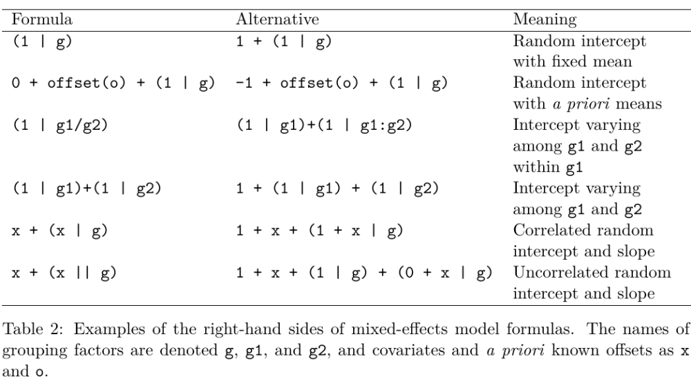

<style type="text/css">
slides > slide:not(.nobackground):after {
  content: '';
}
</style>

```{r setup, include=FALSE}
options(width = 90)
library(knitr)
library(rgl)
knit_hooks$set(rgl = hook_plot_custom)
knit_hooks$set(small.mar = function(before, options, envir) {
    if (before) par(mar = c(4, 4, .1, .1), las = 1)  # smaller margin on top and right
})
hook_output <- knit_hooks$get("output")
knit_hooks$set(output = function(x, options) {
  lines <- options$output.lines
  if (is.null(lines)) {
    return(hook_output(x, options))  # pass to default hook
  }
  x <- unlist(strsplit(x, "\n"))
  more <- "..."
  if (length(lines)==1) {        # first n lines
    if (length(x) > lines) {
      # truncate the output, but add ....
      x <- c(head(x, lines), more)
    }
  } else {
    x <- c(more, x[lines], more)
  }
  # paste these lines together
  x <- paste(c(x, ""), collapse = "\n")
  hook_output(x, options)
})
library(rstanarm)
options(mc.cores = parallel::detectCores())
```

## Review Session for Final Exam

* Classes end tonight
* Review session Thursday, May 5th, from 10AM to 12PM in Hamilton 413
  (across Amsterdam from the hospital)
* Final exam is Monday, May 9th, from 4:10PM to 7PM in IAB 403

## What Are Hierarchical Models

* In Bayesian terms, a hierarchical model is nothing more than a model where the prior distribution
  of some parameter depends on another parameter
* We have already seen several examples:

    * Bowling: $x_2$ depends on $n = 10 - x_1$ and both depend on inability, $\theta$
    * Linear models: $\sigma_Y \thicksim ?$ and 
      $\forall n: \epsilon_n \thicksim \mathcal{N}\left(0,\sigma_Y\right)$
    * Splines: $\sigma_\beta \thicksim ?$ and 
        $\forall k: \beta_k \thicksim \mathcal{N}\left(0, \sigma_\beta\right)$

* In other words, it is just another application of the rules of probability:
$$f\left(\boldsymbol{\theta}\right) = 
  \int f\left(\boldsymbol{\theta}, \boldsymbol{\phi}\right) d\phi_1 \dots d\phi_K = 
  \int f\left(\boldsymbol{\theta} \mid \boldsymbol{\phi}\right)
  f\left(\boldsymbol{\phi}\right) d\phi_1 \dots d\phi_K$$

## Cluster Sampling vs. Stratified Sampling

* For cluster random sampling, you

  * Sample $J$ large units (such as schools) from their population
  * Sample $N_j$ small units (such as students) from the $j$-th large unit

* If you replicate such a study, you get different realizations of the large units
* For stratified random sampling, you

  * Divide the population of large units into $J$ mutually exclusive and exhaustive groups 
    (like states), which are not random variables
  * Sample $N_j$ small units (such as voters) from the $j$-th large unit

* If you replicate such a study, you would use the same large units and only
  get different realizations of the small units

> - The difference between cluster and stratified random sampling is critical if you care about
  the distribution of an estimator across randomly-sampled datasets
  
## Models with Group-Specific Intercepts

- Let $\alpha$ be the common intercept and $\boldsymbol{\beta}$ be the common coefficients while
  $a_j$ is the deviation from the common intercept in the $j$-th group. Write a model as:
$$y_{ij} = \overbrace{\underbrace{\alpha + \sum_{k = 1}^K \beta_k x_{ik}}_{\mbox{Frequentist }
\boldsymbol{\mu} \mid \mathbf{x}}+a_j}^{\mbox{Bayesian } \boldsymbol{\mu} \mid \mathbf{x},j} +
\epsilon_{ij} = \alpha + \sum_{k = 1}^K \beta_k x_{ik}+\underbrace{a_j + 
\overbrace{\epsilon_{ij}}^{\mbox{Bayesian error}}}_{\mbox{Frequentist error}}$$
- The same holds in GLMs where $\eta_{ij} = \alpha + \sum_{k = 1}^K \beta_k x_{ik} + a_j$ 
  or $\eta_{ij} = \alpha + \sum_{k = 1}^K \beta_k x_{ik}$ depending on if you are
  Bayesian or Frequentist
  
## Models with Group-Specific Slopes and Intercepts
  
- Let $\alpha$ be the common intercept and $\boldsymbol{\beta}$ be the common coefficients while
  $a_j$ is the deviation from the common intercept in the $j$-th group and $\mathbf{b}_j$ is
  the deviation from the common coefficients. Write the model as:
$$y_{ij} = \overbrace{\underbrace{\alpha + \sum_{k = 1}^K \beta_k x_{ik}}_{\mbox{Frequentist }
\boldsymbol{\mu} \mid \mathbf{x}} + a_j + \sum_{k = 1}^K b_{jk} x_{ik}}^{\mbox{Bayesian } \boldsymbol{\mu} \mid \mathbf{x},j} + \epsilon_{ij} = \\ \alpha + \sum_{k = 1}^K \beta_k x_{ik}+\underbrace{a_j + \sum_{k = 1}^K b_{jk} x_{ik} + \overbrace{\epsilon_{ij}}^{\mbox{Bayesian error}}}_{\mbox{Frequentist error}}$$
- And similarly for GLMs

## [Frequentist Estimation of Multilevel Models](https://bbolker.github.io/mixedmodels-misc/glmmFAQ.html)

- Frequentists assume that $a_j$ and $b_j$ deviate from the common parameters according
  to a (multivariate) normal distribution, whose (co)variances are common parameters
  to be estimated
- To Frequentists, $a_j$ and $b_j$ are not parameters because parameters must remained
  fixed in repeated sampling of observations from some population
- Since $a_j$ and $b_j$ are not parameters, they can't be "estimated" only "predicted"
- Since $a_j$ and $b_j$ aren't estimated, they must be integrated out of
  the likelihood function, leaving an integrated likelihood function of the common
  parameters
- After obtaining maximum likelihood estimates of the common parameters, each
  $a_j$ and $b_j$ can be predicted from the residuals via a regression
- Estimated standard errors produced by frequentist software are too small
- There are no standard errors, $p$-values, etc. for the $a_j$ and $b_j$
- Maximum likelihood estimation often results in a corner solution

## Data-Generating Processes for Multilevel Models
 
<div class="columns-2">
$$\text{Bayesian} \\
  \sigma_a \thicksim ? \\
  \sigma_b \thicksim ? \\
  \rho \thicksim ? \\
  \forall j: a_j,b_j \thicksim \mathcal{N}_2\left(\left(0,0\right)^\top, 
                                                  \sigma_a, \sigma_b, \rho\right) \\
  \alpha \thicksim ? \\
  \beta \thicksim ? \\
  \forall i,j: \mu_{ij} = \alpha + \beta x_{ij} + a_j + b_j x_{ij} \\
  \sigma_y \thicksim ? \\
  \forall i,j: \epsilon_{ij} \thicksim \mathcal{N}\left(0,\sigma_y\right) \\
  \forall i,j: y_{ij} \equiv \mu_{ij} + \epsilon_{ij}$$
  
  
  $$\text{Frequentist} \\
  \alpha \mbox{ is given} \\
  \beta \mbox{ is given} \\
  \forall i,j: \mu_{ij} = \alpha + \beta x_{ij} \\
  \sigma_a \mbox{ is given} \\
  \sigma_b \mbox{ is given} \\
  \rho \mbox{ is given} \\
  \forall j: a_j,b_j \thicksim \mathcal{N}_2\left(\left(0,0\right)^\top, 
                                                  \sigma_a, \sigma_b, \rho\right) \\
  \sigma_y \mbox{ is given} \\
  \forall i,j: \epsilon_{ij} \thicksim \mathcal{N}\left(a_j + b_j x_n, \sigma_y\right) \\
  \forall i,j: y_{ij} \equiv \mu_{ij} + \epsilon_{ij}$$
</div>


## Table 2 from the **lme4** [Vignette](https://www.jstatsoft.org/article/view/v067i01/0) (see also the [FAQ](https://bbolker.github.io/mixedmodels-misc/glmmFAQ.html#model-specification))



## Hierarchical Models in Psychology

- In political science and economics, the "big" units are often countries or sub-national
  political areas like states and the "small" units are people
- In [psychology](https://arxiv.org/pdf/1506.04967.pdf), the "big" units are often people and 
  the "small" units are questions or outcomes on repeated tasks
- Hierarchical model syntax is like
```{r, eval = FALSE}
y ~ x + (x | person) + (1 | question)
```

> - Question of interest is how to predict `y` for a new "big" unit (person), as opposed
  to predicting how well an old "big" unit will answer a new "small" unit (question), but
  you could do either

## Hierarchical Models in **rstanarm** (from this [paper](http://www.tqmp.org/RegularArticles/vol14-2/p099/p099.pdf))

```{r, message = FALSE}
dat <- readr::read_csv("https://osf.io/5cg32/download")
```

```{r, psych, cache = TRUE, results = "hide", warning = FALSE}
post <-  stan_glmer(valence ~ arousal + (1 + arousal | PID), data = dat,
                    prior = normal(0, 1), prior_intercept = normal(50, 20),
                    prior_aux = exponential(rate = 0.1))
```
<div class="columns-2">
```{r, output.lines = (6:20), warning = FALSE}
post
```
</div>

## Accessor Functions (based on the **lme4** package)

```{r}
fixef(post) # posterior medians in rstanarm
cbind(b = head(ranef(post)$PID), total = head(coef(post)$PID))
dim(as.matrix(post)) # 4000 x 46
```

## Posterior Predictive Checks

```{r, fig.width=10, fig.height=5}
pp_check(post, plotfun = "ribbon_grouped", x = dat$arousal, group = dat$PID)
```

## Posterior Prediction

```{r}
PPD <- posterior_predict(post) # of previous people
nd <- dat[dat$PID == 1, ]
nd$PID <- 0L # a new person
PPD_0 <- posterior_predict(post, newdata = nd) # 4000 x 14
```

- How is that even possible? For each of the $S$ posterior draws, $\dots$

    1. Draw $a_0$ and $b_0$ from a bivariate normal with means zero and
      covariance matrix $\Sigma$
    2. Form $\boldsymbol{\mu}_0 \equiv \alpha + a_0 + \left(\beta + b_0\right) \mathbf{x}$
    3. Draw each $\epsilon_t$ from a normal distribution with mean zero
      and standard deviation $\sigma$
    4. Form $\mathbf{y}_0 = \boldsymbol{\mu}_0 + \boldsymbol{\epsilon}$

## Projection Pursuit

- When you simplify a model by assuming some parameter "is" zero, you must propagate your
  uncertainty as to whether that parameter actually is zero to the other, nonzero parameters
  when estimating the ELPD
```{r, projpred, cache = TRUE, message = FALSE, results = "hide", warning = FALSE}
library(projpred); library(optimx); cvv <- cv_varsel(post)
```
```{r, fig.width=10, fig.height=3}
plot(cvv)
```

## Finding the Optimal Submodel

```{r, fig.width=10, fig.height=3, warning = FALSE}
summary(cvv); bayesplot::mcmc_areas_ridges(as.matrix(projpred::project(cvv, nterms = 2)))
```

## Frequentist Multilevel Model Example

```{r, message = FALSE, warning = FALSE}
poll <- readRDS("GooglePoll.rds") # WantToWin is coded as 1 for Romney and 0 for Obama
poll$Income[poll$Income == "150,000+"] <- "100,000-149,999" # too few rich people
library(dplyr)
collapsed <- filter(poll, !is.na(WantToWin)) %>%
             group_by(Region, Gender, Urban_Density, Age, Income) %>%
             summarize(Romney = sum(grepl("Romney", WantToWin)), Obama = n() - Romney) %>%
             na.omit
```
```{r, glmer, cache = TRUE, results = "hide", warning = FALSE}
lme4::glmer(cbind(Romney, Obama) ~ Gender + Urban_Density + Age + Income +
              (Gender + Urban_Density + Age + Income | Region),
            data = collapsed, family = binomial(link = "logit"))
```

> - For models that are more complicated than `(1 + x | g)`, the MLE of $\boldsymbol{\Sigma}$ ---
  which is the covariance among the group-specific intercepts and slopes ---
  usually implies that $\widehat{\boldsymbol{\Sigma}}^{-1}$ does not exist

## Bayesian Version of the "Same" Model Works Fine {.smaller}

But needed a prior on a $13 \times 13$ variance-covariance matrix, $\boldsymbol{\Sigma}$
```{r, post_h, cache = TRUE, results = "hide"}
post_h <- stan_glmer(cbind(Romney, Obama) ~ Gender + Urban_Density + Age + Income +
                       (Gender + Urban_Density + Age + Income | Region),
                     data = collapsed, family = binomial(link = "logit"), 
                     QR = TRUE, adapt_delta = 0.98, seed = 12345)
```
```{r}
VarCorr(post_h) # posterior means of elements of Sigma
```

## [Poststratification](https://arxiv.org/abs/1906.11323) {.build}

- Posterior distributions are conditional on the data you collected, which may or may not
  be a random sample or otherwise representative of a population, so how do you make
  principled claims about a population?
- Frequentists utilize weights while estimating parameters; Bayesians use (different)
  weights after estimating the parameters.
```{r}
mu <- posterior_epred(post_h); dim(mu)
```

> - Assume `shares` is the proportion of voters for each level of
`Gender`, `Urban_Density`, `Age`, and `Income` crossed with `Region`
```{r, eval = FALSE}
mu_US <- mu %*% shares # matrix-vector multiplication yields a vector of size 4000
```

> - Now you have a posterior distribution for the proportion
  supporting Romney for the United States as a whole

## PSISLOOCV (of a group, assuming that is sensible)

```{r, output.lines = 4:16}
(loo_hier <- loo(post_h)) # 156 nominal parameters but much fewer effective parameters
```

## What Were the Priors?

```{r}
prior_summary(post_h)
```

## What Is `decov(1, 1, 1, 1)`?

- `decov` = Decomposition of Covariance
- `reg.` is the regularization parameter in the LKJ prior on the correlation matrix
- `conc.` is the concentration parameter in the Dirichlet prior on the variance components
- `shape` and `scale` pertain to the Gamma prior on multiplier for the variance components

> - You usually do not need to change these defaults to get good results

## McElreath / Kotz [Example](http://www.pnas.org/content/112/40/12349.abstract) 

```{r, message = FALSE}
library(brms)
funding <- 
  tibble(
    discipline   = rep(c("Chemical sciences", "Physical sciences", "Physics", "Humanities", 
                         "Technical sciences",  "Interdisciplinary", "Earth/life sciences", 
                         "Social sciences", "Medical sciences"),
                     each = 2),
    gender       = rep(c("m", "f"), times = 9),
    applications = c(83, 39, 135, 39, 67, 9, 230, 166, 189, 62, 105, 78, 156, 126, 425, 409, 245, 260),
    awards       = c(22, 10, 26, 9, 18, 2, 33, 32, 30, 13, 12, 17, 38, 18, 65, 47, 46, 29),
    rejects      = c(61, 29, 109, 30, 49, 7, 197, 134, 159, 49, 93, 61, 118, 108, 360, 362, 199, 231),
    male         = ifelse(gender == "f", 0, 1) %>% as.integer()
  )
```
```{r, bonus, cache = TRUE, results = "hide"}
b13.bonus_2 <- 
  brm(awards | trials(applications) ~ 1 + male + (1 + male | discipline),
      data = funding, family = binomial, control = list(adapt_delta = 0.92),
      prior = c(prior(normal(0, 4), class = Intercept), prior(normal(0, 4), class = b),
                prior(cauchy(0, 1), class = sd), prior(lkj(4), class = cor)))
```

## Overall Results {.smaller}

```{r}
b13.bonus_2
```

## Disclipline Specific Results {.smaller}

<div class="columns-2">
```{r}
print(coef(b13.bonus_2), 
      digits = 3)
```

> - In light of the considerable uncertainty for a department, these data
  are consistent with both discrimination and no discrimination by sex
</div>
